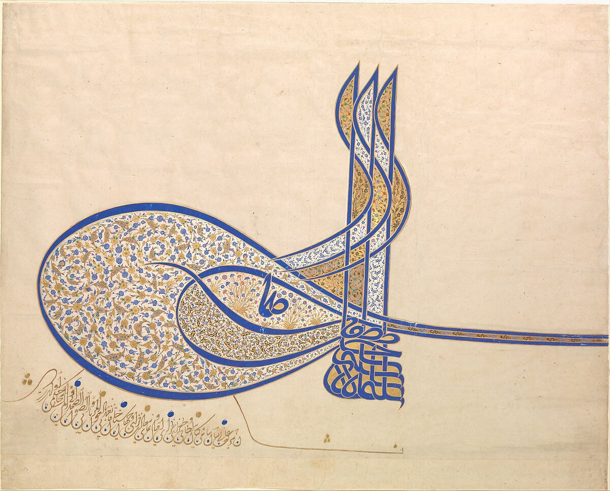

  

 Hello! my name is Said Sheck.

 🎓 I am a recent 2024 mathematics graduate from the University of Washington

 📊  I have a strong passion for statistics and computer science, with a keen interest in exploring software engineering and  data science.

 🚀 Click around to learn what I've been up to over the last few years!

# Work and Research Experience

## 🔎 Student Researcher 
### Washington Experimental Math Lab (WXML)
  * As a researcher, my colleagues and I investigated the influence of modern mathematical tools on electoral districting.

  * We employed mathematical techniques such as Markov Chains, Monte Carlo methods, and generative AI to measure and assess the partisan biases embedded in electoral district maps, with a specific focus on understanding their impact on political representation.

  * Aiming to use the same tools to create a more accurate and equitable political situation.

## 💻 Research Intern
### National Oceanic & Atmospheric Administration (NOAA)
  * I developed tools in R to enhance the accessibility of data provided by the NW Fisheries Science Center for a broader audience.

  * I leveraged the R package, R-Shiny, to transform our outdated Excel file into a user-friendly interface.

## 📁 Student Fiscal Assistant 
### University of Washington College of Education
  * As a student assistant, I was responsible for assisting the department with various financial tasks.
  *  These tasks included processing reimbursements, reconciling myFD accounts, and processing check deposits.