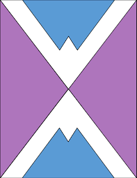

# Work and Research Experience

## 🔎 Student Researcher 
### Washington Experimental Math Lab (WXML) 
  - As a researcher, my colleagues and I investigated the Voting Rights Violation lawsuit filed against Washington State in the aftermath of the 2020 legislative redistricting process.

  - We employed mathematical concepts such as Markov Chains and Spanning Trees to generate and establish over 20,000 alternatives maps

  - We created a dataset that overlaps voting results from previous elections and demographic data using GIS mapping software for over 8000 voting precincts

  - Finally we employed statistical techniques like ecological inference to establish if racial vote dilution was committed against the Latino community in the Yakima River Valley Are

## 💻 Research Intern
### National Oceanic & Atmospheric Administration (NOAA) 
  - Led by mentors from NOAA, I focused on creating user-friendly software applications to enhance accessibility to crucial fisheries management data. 
  - I developed a Stock Assessment Prioritization tool to address the challenge of prioritizing over 90 groundfish stocks, making the decision-making process more   intuitive by turning an offline workbook into an interactive graphical user interface. 
  - Additionally, the project included a Data Availability tool that summarized essential data for each species, providing decision-makers with key information to support stock assessments and offering the intern opportunities to improve coding skills and contribute to impactful West Coast groundfish fishery management planning.

## 📁 Student Fiscal Assistant 
### University of Washington College of Education 
  - As a student assistant, I was responsible for assisting the department with various financial tasks.
  - These tasks included processing reimbursements, reconciling myFD accounts, and processing check deposits.